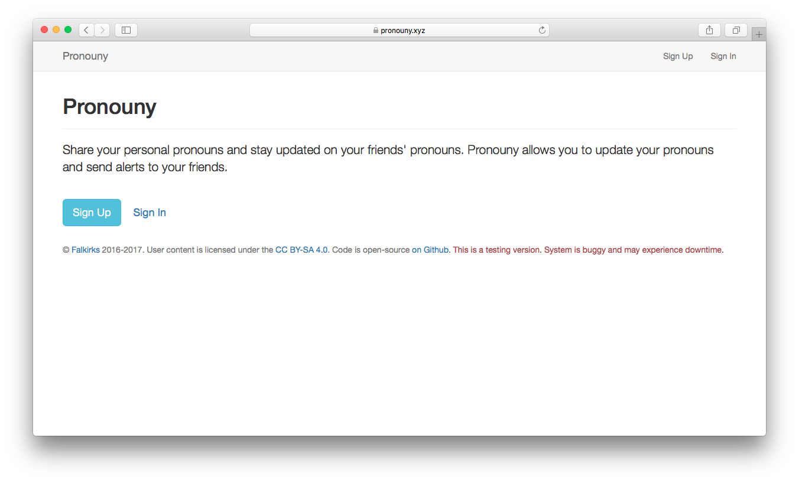
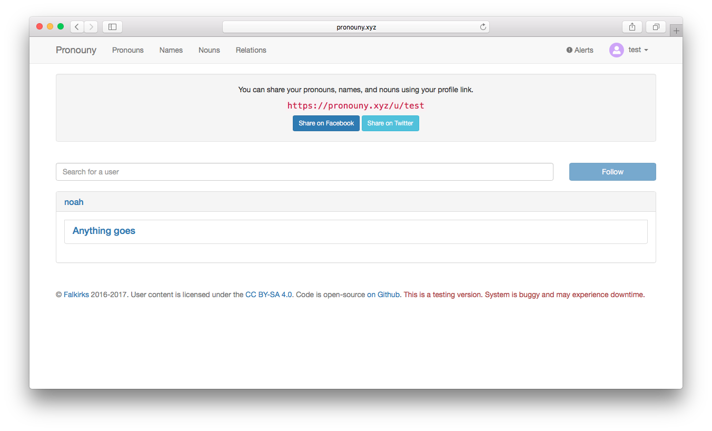
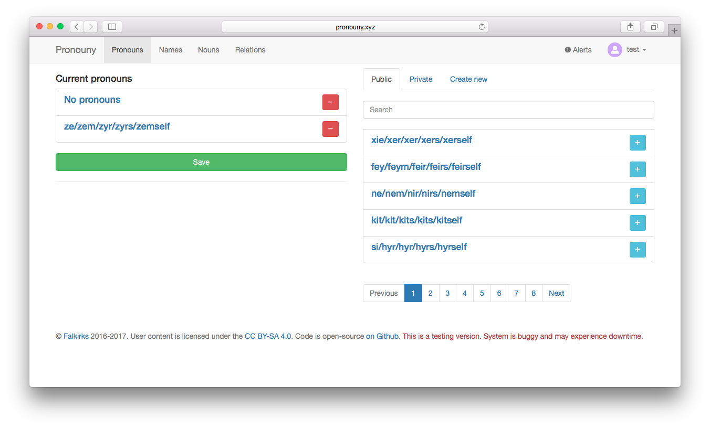

# pronouny
[](https://travis-ci.org/pronouns/main)

Pronouny is an open source app for sharing identity information (name, pronouns, gendered nouns) with your friends (and maybe web services too). Think Gravatar, but for information which helps you talk about a person.







## Why?
The application was created to serve two main use cases. First, when meeting people for the first time online, it would be helpful to be able to look them up by email and figure out how you should refer to them in future correspondance. This extends to web services that want to personalize user experience. The second purpose is to allow people who change there pronouns or other information frequently, to ensure that their friends are up to date. 

## Prerequisites

```bash
$ npm install -g bower
```
```bash
$ gem install sass
```

## Installation
```bash
$ git clone https://github.com/pronouns/main pronouns
$ cd pronouns
$ npm install
```

## Running pronouny
After the install process is over, you'll be able to run pronouny:

```
$ npm start
```

pronouny should be running on port 3000 with the *development* environment configuration, so in your browser just go to [http://localhost:3000](http://localhost:3000)


## Tests

```bash
$ npm test
```

This will run both the server-side tests and the client-side tests.


## License
(The MIT License)

Permission is hereby granted, free of charge, to any person obtaining
a copy of this software and associated documentation files (the
'Software'), to deal in the Software without restriction, including
without limitation the rights to use, copy, modify, merge, publish,
distribute, sublicense, and/or sell copies of the Software, and to
permit persons to whom the Software is furnished to do so, subject to
the following conditions:

The above copyright notice and this permission notice shall be
included in all copies or substantial portions of the Software.

THE SOFTWARE IS PROVIDED 'AS IS', WITHOUT WARRANTY OF ANY KIND,
EXPRESS OR IMPLIED, INCLUDING BUT NOT LIMITED TO THE WARRANTIES OF
MERCHANTABILITY, FITNESS FOR A PARTICULAR PURPOSE AND NONINFRINGEMENT.
IN NO EVENT SHALL THE AUTHORS OR COPYRIGHT HOLDERS BE LIABLE FOR ANY
CLAIM, DAMAGES OR OTHER LIABILITY, WHETHER IN AN ACTION OF CONTRACT,
TORT OR OTHERWISE, ARISING FROM, OUT OF OR IN CONNECTION WITH THE
SOFTWARE OR THE USE OR OTHER DEALINGS IN THE SOFTWARE.
